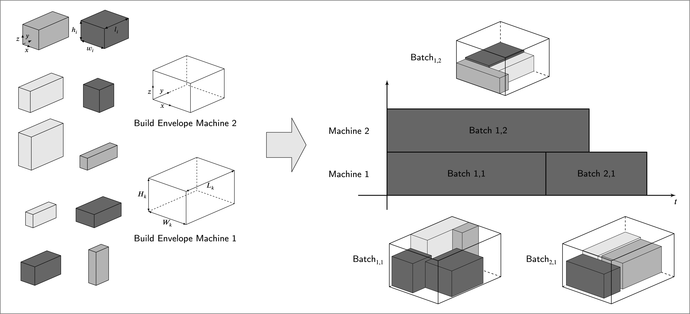

# An exact decomposition-based solver for integrated scheduling on parallel machines and two-dimensional packing

This code was developed for a study entitled *A new branch-and-cut approach for integrated planning in additive manufacturing*, published in European Journal of Operational Research (2025).

[Link to publication](https://doi.org/10.1016/j.ejor.2024.10.040)

---

## Problem

Additive manufacturing machines build several parts at the same time within a shared build
chamber. Planning the production of several parts on parallel machines therefore means solving two decisions at once: which parts are grouped into a build job/batch, and when each job is processed on which machine. The two decisions cannot be separated. Whether a subset of parts forms a valid job depends on whether they fit into the build area together, and that in turn determines how much machine time the job consumes.

Consequently, we are facing an integrated problem over (unrelated) parallel machines. The scheduling assigns jobs to machines, and sequences them. In addition, there is a two-dimensional orthogonal packing problem to form the jobs from a subset of parts. In our case the packing problem is considered with rotation, since parts may be turned by 90 degrees to improve utilisation. Both subproblems are NP-hard on their own.



*Example instance with ten parts and two machines, and a possible feasible solution with three batches, sequenced across the two machines. Figure from [Zipfel, Tamke & Kuttner (2025)](https://doi.org/10.1016/j.ejor.2024.10.040),
CC BY 4.0.*

## Approach

To solve this problem, we first introduced a monolithic model formulation as a mixed-integer linear program. In this repository, we developed a solver that implements an exact approach based on logic-based Benders decomposition. We split the problem into a master and a subproblem. The master problem is a MIP for scheduling on unrelated parallel batch processor machines, minimising makespan. It assigns parts to batches and machines and sequences the batches. A batch's processing time is not a max or a sum over its jobs, as in classical batch scheduling. It depends on the scan time for the batch's total volume plus the recoating time for the tallest part in it. Geometry therefore feeds directly into the objective, which is what forces the two subproblems together. For every incumbent, each non-empty batch is checked as a two-dimensional orthogonal packing problem with rotation (2D-OPR), and any batch proven unpackable yields a no-good cut. Feasibility checking is where most of the runtime goes, so the subproblem extends state-of-the-art techniques for orthogonal packing with rotation.

### Key design decisions:
- *Feasibility checking as a cascade.* Solving the 2D-OPR exactly is
  expensive, so we try to identify infeasibility cheaply first: (I) preprocessing, (II) two lower bounds, and (III) a bar relaxation solved by column generation. Only when infeasibility is not proven by the subsequent approaches, an exact CP model is built and solved. Most infeasible batches can be found before the exact step, which is where the runtime savings come from. If this is the case, the algorithm immediately exits the checking procedures in the subproblem and adds a no-good cut to the master problem. 
- *Rotation had to be threaded through every component.* Each adapted  technique (normal patterns, meet-in-the-middle placement points, the bar relaxation's pricing subproblem, the item-enlargement procedure) assumes fixed orientation in its published form. Consequently, all methods needed extension to handle 90-degree rotation.
- *Cut strengthening and lifting.* Raw no-good cuts over large batches are weak, so each infeasible set is heuristically reduced to a smaller infeasible subset and the cut is lifted. Lifting is expensive per cut but cuts the total number of cuts by an order of magnitude on hard instances and the total runtime with it.
- *Avoiding the hardest packings rather than solving them.* The dominant failure mode is getting stuck on batches with 97–100% area utilisation, which are hard to decide and rarely feasible anyway. A two-step variant first solves with batch area capped at 90%, then warm-starts the unrestricted run from that solution.
- *Off-the-shelf solvers.* The 2D-OPR is handled by a general CP model rather than a tailored packing algorithm, so the approach stays replicable and language-agnostic. In this realm, we also compared a CP model built with OR-Tools with a CP model with CP Optimizer and another exact Branch&Cut approach from [Delorme et al. (2017)](https://doi.org/10.1016/j.cor.2016.09.009).

## Structure

```
main.py                     Entry point — runs the B&C solver on a small demo instance
requirements.txt            Python dependencies
PlanningProblem.jpg         Illustration of the planning problem

src/
  Solver.py                 B&C solver orchestrator; wires scheduler, packing, preprocessing and callbacks; CLI entry point
  Scheduler.py              Gurobi MIP for the scheduling master problem (parts -> batches -> machines, min makespan)
  SchedulingCallback.py     Gurobi lazy-constraint callback adding packing feasibility cuts at integer nodes
  StrippackingCallback.py   Gurobi callback enforcing strip-packing feasibility cuts within a 1D arc-flow model
  ConstructiveAlgorithms.py Constructive heuristic to provide an initial feasible solution
  DataManager.py            Data classes (Machine, Part, Variant, etc.)
  Enums.py                  Enums (solver variants, packing methods, etc.)
  Helper.py                 Helper functions
  OrthogonalPacker.py       OR-Tools CP-SAT model for 2D orthogonal packing feasibility checking
  OrthogonalPackerCplex.py  CPLEX CP Optimizer alternative for the 2D packing feasibility sub-problem
  OrthogonalRelaxation.py   Gurobi LP relaxation of the 2D packing problem using Fekete-Schepers conservative scales
  BarRelaxation.py          Column generation approach as a feasibility check for the packing sub-problem
  OneDimContBinPacker.py    Gurobi MIP for 1D continuous bin packing used as a relaxation
  LowerBounds.py            Area-based lower bounds on required bins for 2D bin packing (Dell'Amico et al. 2002)
  PlacementPoints.py        Generates reduced sets of valid placement coordinates (normal / meet-in-the-middle patterns)
  Preprocess.py             Preprocessing routines shrinking bin dimensions and inflating item sizes via subset-sum arguments
  KnapSack.py               2D Knapsack problem to lift the no-good cuts
  LiftingLP.py              Lifting procedure for the strip-packing callback when OrthogonalPackingMethod.BNC is active

data/                       Test instances (n10m2 ... n80m5) and packing benchmark data

results/
  MIP/                      Monolithic MIP results
```

## Requirements

- Python 3.9
- GUROBI $^{*}$, Google OR-Tools, CP Optimizer $^{**}$
- Further dependencies in `requirements.txt`

$^{*}$  : Licence required for larger problem instances
$^{**}$ : Installation required if OrthogonalPackingMethod.CPLEX is chosen

## Quick start

To quickly run and test the code, no GUROBI licence is needed. The free version coming with installing gurobipy package enables the solving of small instances stated in main.py.

```bash
git clone https://github.com/bened1ktz1pfel/AM-BatchScheduling-2DPacking-BNC.git
cd AM-BatchScheduling-2DPacking-BNC
python -m venv .venv && source .venv/bin/activate
pip install -r requirements.txt

python main.py
```

Expected output (Gurobi solver log omitted):

```
This is a demo run of the BNC solver for scheduling with 2D orthogonal packing.
================================
...
Finished processing folder: n10m2. Results saved in: .../results/BNC_TV_demo/n10m2
================================
```

## Further running options

Further solver options are available using Solver.py from the command line. For some solver options IBM CP Optimizer must be installed on your computer. In addition, for solving larger problems an (academic) licence of GUROBI is necessary.

```bash
python src/Solver.py [foldername] [Solvervariant_id]
```

**Example:** `python src/Solver.py n10m2 3` runs the full OR-Tools variant on the n10m2 instances.

Available solver variants:

| ID | Short name | Description |
|----|------------|-------------|
| 1  | TV         | Test variant (OR-Tools packing) |
| 2  | BV         | Base variant — no preprocessing, no relaxations |
| 3  | FORT       | Full variant (OR-Tools packing) |
| 6  | PORT       | Full variant with two-step pre-solve (OR-Tools) |
| 7  | FORTNCL    | Full variant without cut lifting (OR-Tools) |
| 8  | FINORT     | Final variant (OR-Tools), no packing heuristics |
| 9  | FINCP      | Final variant (CPLEX packing), no packing heuristics |
| 10 | FINBNC     | Final variant (Cython B&B packing), no packing heuristics |
| 11 | BPV        | Base-plus variant — model improvements only |
| 12 | NISV       | No initial solution variant |
| 13 | NPHNLV     | No packing heuristic, no lifting |
| 14 | NPHV       | No packing heuristic, with lifting |

## Additional note

This repository is an accessible version of the original code that was cleaned from former legacy files and result files. If you are interested in the result files, we refer to the [data repository](https://data.mendeley.com/preview/k4vvbvf5kb?a=6b4d984e-f13c-4eee-a87a-ba164838aa6f) provided with the manuscript.

Last tested using Python 3.9 and GUROBI 12.0.3 in September 2026.
